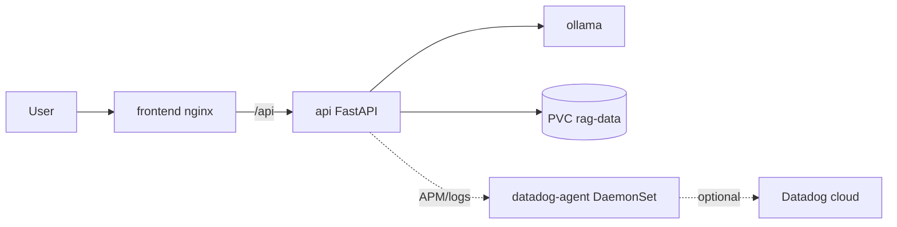

# MTG Commander RAG

A local **Retrieval-Augmented Generation (RAG)** app for Magic: The Gathering **Commander (EDH)**. Ask questions about competitive decks, card rules, and EDHRec meta; log in to save your own decklists.

Powered by **ChromaDB**, **LlamaIndex**, and **Ollama** (`llama3.2:3b` + `nomic-embed-text` by default; larger models if you have enough RAM).

## Features

- **Commander Oracle** — natural-language Q&A over card rules and scraped decklists
- **EDHRec intelligence** — synergies, themes, and staple cards per commander
- **Color-aware answers** — parses requests like “blue-red” as Izzet (U/R), not Azorius
- **Save decklists** — when a response includes a deck list, logged-in users can save it to **My Decks**
- **Runs locally or on Minikube** — same API with automatic indexing on cluster startup
- **Optional Datadog** — JSON logs, APM, DogStatsD, and Kubernetes infrastructure via a Kustomize overlay

---

## Quick start (local)

### Prerequisites

1. **Python 3.11+** and a virtualenv  
2. **Ollama** with models:
   ```bash
   ollama pull llama3.2:3b
   ollama pull nomic-embed-text
   ```
3. **Node.js 18+** (for the frontend)
4. **Card database** — download [MTGJSON AtomicCards](https://mtgjson.com/downloads/all-files/) to `context/AtomicCards.json` (~147 MB)

### 1. Backend

From the **project root** (`MTG-Rag/`):

```bash
python -m venv .venv
source .venv/bin/activate
pip install -r requirements.txt
cp .env.example .env   # set SECRET_KEY; optional Datadog vars
uvicorn api.main:app --reload --host 127.0.0.1 --port 8000
```

On first start the API will **index Commander-legal cards** if `ingestion/mtg_db/` is empty (can take 20–40 minutes). Set `AUTO_DOWNLOAD_CARDS=true` in `.env` to fetch `AtomicCards.json` automatically.

For Datadog APM locally, use `ddtrace-run uvicorn ...` (see [Datadog observability](#datadog-observability)).

### 2. Frontend

```bash
cd frontend
npm install
npm run dev
```

Open [http://localhost:5173](http://localhost:5173) — Vite proxies `/api` to port 8000.

### 3. Refresh deck knowledge (optional, better answers)

```bash
# Scrape EDHRec meta + decklists, then insert into the index
python -m ingestion.scrapper

# Re-index all enriched files without re-embedding every card
python -m ingestion.scrapper reindex
```

Outputs live under `ingestion/scraped_decks/` and `ingestion/scraped_decks/knowledge/`.

---

## Minikube (Kubernetes)

Run **Ollama**, the **API**, and the **frontend** in a local cluster with persistent storage for models and the vector index.

### Prerequisites

| Tool | Install |
|------|---------|
| [Minikube](https://minikube.sigs.k8s.io/docs/start/) | `brew install minikube` |
| [kubectl](https://kubernetes.io/docs/tasks/tools/) | `brew install kubectl` |
| [Docker Desktop](https://www.docker.com/products/docker-desktop/) | Required as Minikube driver |

**Memory:** The deploy script requests **6 GB** for Minikube (fits Docker Desktop’s default 8 GB VM). The cluster uses **`llama3.2:3b`** with a capped context window so chat fits in that RAM. For a larger cluster or `llama3.1:8b`, increase Docker Desktop memory:

```bash
# Docker Desktop → Settings → Resources → Memory ≥ 12 GB, then:
MINIKUBE_MEMORY=10240 ./scripts/minikube-deploy.sh
```

### Deploy (one command)

Run from the **project root** — not `ingestion/` or `scraped_decks/`:

```bash
chmod +x scripts/*.sh
./scripts/minikube-deploy.sh
```

The script will:

1. Start Minikube (if needed) and set `kubectl` context to `minikube`
2. Enable the ingress addon
3. Build `mtg-rag-api` and `mtg-rag-frontend` images inside Minikube’s Docker
4. Apply manifests (`kubectl apply -k k8s/base` — namespace `mtg-rag`)
5. Wait for Ollama and pull `llama3.2:3b` + `nomic-embed-text`
6. Wait for the API deployment (first boot **indexes inside the cluster**)

### Automatic indexing on API startup

When `AUTO_INDEX_ON_STARTUP=true` (default in `k8s/base/configmap.yaml`), each API pod will:

1. Wait for Ollama and required models  
2. Download `AtomicCards.json` if missing (`AUTO_DOWNLOAD_CARDS=true`)  
3. Embed Commander-legal cards into Chroma (first time: **~20–40 min**, persisted on PVC)  
4. Index any deck/EDHRec files under `ingestion/scraped_decks/` on the volume  

Watch progress (bootstrap lines are prefixed `[mtg-rag]` and emitted as JSON when Datadog logging is on):

```bash
kubectl -n mtg-rag get pods -w
kubectl -n mtg-rag logs -f deployment/api
```

Wait until logs show `Application startup complete` and `/api/ready` returns 200.

### Access the app

On **Minikube with the Docker driver (macOS)**, `http://$(minikube ip):30080` often **does not work** until a tunnel or port-forward is running. Pods can be `Running` while the browser times out.

**Option A — port-forward (simplest):**

```bash
kubectl -n mtg-rag port-forward svc/frontend 30080:80
# Keep that terminal open, then:
open http://127.0.0.1:30080
```

**Option B — Minikube tunnel:**

```bash
# Terminal 1 — leave open
minikube tunnel
# Terminal 2
open "http://$(minikube ip):30080"
```

**Option C — Minikube service helper:**

```bash
minikube service frontend -n mtg-rag
```

Check health:

```bash
curl -s http://127.0.0.1:30080/api/health | python3 -m json.tool
```

### Optional: seed an existing local index

Skip the long first-time card embedding by copying your local data into the cluster:

```bash
./scripts/minikube-seed-data.sh
```

Requires `context/AtomicCards.json`, and ideally `ingestion/mtg_db/` already built locally.

### Teardown

```bash
./scripts/minikube-teardown.sh
# PVCs remain unless deleted:
# kubectl delete pvc -n mtg-rag ollama-models rag-data
```

### Minikube troubleshooting

| Symptom | Fix |
|---------|-----|
| `connection refused` on `localhost:8080` | Wrong kubectl context: `minikube start` then `kubectl config use-context minikube` |
| `namespace "mtg-rag" not found` | Run `./scripts/minikube-deploy.sh` from project root |
| Browser cannot open `minikube ip:30080` | Use [port-forward](#access-the-app) or `minikube tunnel` (Docker driver on Mac) |
| API stuck at `Waiting for application startup` | First-time card indexing; watch `kubectl -n mtg-rag logs -f deployment/api` (20–40+ min) |
| API pod `Pending` | Insufficient memory: `kubectl describe pod -n mtg-rag -l app=api` |
| `/api/query` **500** — `requires more system memory` | Ollama cannot load the chat model. Cluster defaults: `llama3.2:3b`, `OLLAMA_LLM_NUM_CTX=4096`. Rebuild/restart API after changing `k8s/base/configmap.yaml`. |
| `/api/query` **500** — `timed out` | Normal on CPU-only Minikube; first answer can take **1–3+ minutes**. `OLLAMA_REQUEST_TIMEOUT=900` in cluster config. |
| `kustomize` security error on overlay | Manifests live under `k8s/base/`; overlay references `../../base`, not loose files in `k8s/`. |

---

## API reference

| Method | Path | Description |
|--------|------|-------------|
| GET | `/api/health` | Liveness + `rag_ready`, indexing phase/message |
| GET | `/api/ready` | **503** until RAG index is ready (used by K8s readiness probe) |
| POST | `/api/query` | Ask Commander questions (`{"question": "..."}`) |
| POST | `/api/auth/register` | Create account (JSON: `email`, `password`) |
| POST | `/api/auth/login` | OAuth2 form login (`username`=email, `password`) |
| GET | `/api/auth/me` | Current user (Bearer token) |
| GET/POST/PUT/DELETE | `/api/decks` | Saved decklists (auth required) |

Query responses may include `has_decklist`, `decklist` (parsed card list), and `color_identity` when colors are detected in the question.

---

## Configuration

Copy `.env.example` to `.env` for local development. In Minikube, edit `k8s/base/configmap.yaml` and `k8s/base/secret.yaml`.

| Variable | Default | Description |
|----------|---------|-------------|
| `SECRET_KEY` | (change me) | JWT signing key |
| `OLLAMA_BASE_URL` | `http://127.0.0.1:11434` | Ollama API (`http://ollama:11434` in cluster) |
| `OLLAMA_LLM_MODEL` | `llama3.2:3b` | Chat model; `llama3.1:8b` only if Ollama has ~20+ GiB free |
| `OLLAMA_LLM_NUM_CTX` | `4096` | Max context tokens (lowers RAM on Minikube) |
| `OLLAMA_EMBED_MODEL` | `nomic-embed-text` | Embedding model |
| `OLLAMA_REQUEST_TIMEOUT` | `300` / `900` in K8s | Seconds to wait for Ollama chat/embed |
| `AUTO_INDEX_ON_STARTUP` | `true` | Index cards + decks on API boot |
| `AUTO_DOWNLOAD_CARDS` | `false` / `true` in K8s | Download AtomicCards.json if missing |
| `ATOMIC_CARDS_URL` | MTGJSON API URL | Source for card download |
| `INDEX_DECKS_ON_STARTUP` | `true` | Index `scraped_decks/` files on boot |
| `CORS_ORIGINS` | localhost dev URLs | Comma-separated allowed origins |
| `DD_API_KEY` | — | Datadog **API** key (see Datadog section; not Application key) |
| `DD_SITE` | `datadoghq.com` | `datadoghq.eu` for EU orgs |
| `DD_TRACE_ENABLED` | `false` | FastAPI/SQLAlchemy/requests APM via `ddtrace` |
| `DD_METRICS_ENABLED` | `false` | DogStatsD bootstrap/query metrics |
| `DD_LOGS_JSON` | `true` | JSON logs on stdout for Datadog log pipelines |
| `DD_SERVICE` / `DD_ENV` / `DD_VERSION` | see `.env.example` | Unified service tags |
| `DD_AGENT_HOST` | `127.0.0.1` | Datadog Agent host (node IP in Kubernetes) |

---

## Datadog observability

The API emits **JSON logs** (with optional trace correlation), **APM traces** for HTTP, RAG bootstrap, and `/api/query`, and **DogStatsD** gauges for bootstrap phases when enabled. The Minikube overlay adds a **DaemonSet agent** for logs, APM, process/containers, and Kubernetes metadata.

### API keys (read this first)

- Use an **API key** from [Organization Settings → API Keys](https://app.datadoghq.com/organization-settings/api-keys).
- Do **not** use an **Application key** (different product; validation will fail with HTTP 403).
- Match **region** in `.env`:
  - US: `DD_SITE=datadoghq.com`
  - EU: `DD_SITE=datadoghq.eu` (log in at `app.datadoghq.eu`)
- No quotes in `.env`: `DD_API_KEY=abc123...` not `DD_API_KEY="..."`

### Local development

1. Run a [Datadog Agent](https://docs.datadoghq.com/agent/) on your machine:

   ```bash
   docker run -d --name dd-agent \
     -e DD_API_KEY=<your-api-key> \
     -e DD_APM_ENABLED=true \
     -e DD_DOGSTATSD_NON_LOCAL_TRAFFIC=true \
     -p 8126:8126/tcp -p 8125:8125/udp \
     gcr.io/datadoghq/agent:7
   ```

2. In `.env`: `DD_TRACE_ENABLED=true`, `DD_METRICS_ENABLED=true`, `DD_API_KEY`, `DD_SITE`.

3. Start the API:

   ```bash
   ddtrace-run uvicorn api.main:app --reload --host 127.0.0.1 --port 8000
   ```

In Datadog: **APM → Services** (`mtg-rag-api`), **Logs** (source `python`), **Metrics** (`mtg_rag.bootstrap.*`).

### Minikube + Datadog

1. Configure `.env`:

   ```bash
   cp .env.example .env
   # DD_API_KEY=<32-char API key>
   # DD_SITE=datadoghq.com   # or datadoghq.eu
   ```

2. Run the setup script (validates the key, updates the cluster secret, applies overlay, rebuilds API):

   ```bash
   chmod +x scripts/datadog-k8s-setup.sh
   ./scripts/datadog-k8s-setup.sh
   ```

   You must see **`API key OK (site: …)`** before anything is deployed. If validation fails, fix the key/site — the agent will not send infrastructure, logs, or traces until the key returns HTTP 200.

3. Confirm the agent is healthy:

   ```bash
   kubectl -n mtg-rag logs -l app=datadog-agent --tail=20
   ```

   There should be **no** `API key is invalid` or repeated kubelet errors.

4. In Datadog (after 2–5 minutes):

   - **Infrastructure → Containers** — filter `cluster:mtg-rag-minikube`
   - **APM → Services** — `mtg-rag-api`, env `minikube`
   - **Logs** — service `mtg-rag-api`, source `python`

### Datadog troubleshooting

| Symptom | Fix |
|---------|-----|
| Setup script: `Datadog rejected this API key` | Wrong key type, wrong `DD_SITE`, revoked key, or quotes in `.env`. Create a new **API** key; script auto-tries EU if US fails. |
| Infrastructure empty, agent logs `403` | Same as above — re-run `./scripts/datadog-k8s-setup.sh` after fixing `.env`. |
| `impossible to reach Kubelet` | Addressed in overlay (`DD_KUBELET_TLS_VERIFY=false`, `DD_KUBERNETES_KUBELET_NODENAME`). Restart agent: `kubectl -n mtg-rag rollout restart daemonset/datadog-agent` |
| APM in API logs: `Connect` to `:8126` | Agent must expose hostPort 8126 (in overlay). Ensure agent pod is Running on the same node as the API. |
| `kustomize` path / security error | Apply with `kubectl apply -k k8s/overlays/datadog` only; do not list parent YAML paths from the overlay folder. |

---

## Project layout

```
MTG-Rag/
├── api/                    # FastAPI: query, auth, decks, observability
├── ingestion/              # RAG pipeline, scraper, startup indexing
│   ├── mtg_db/             # Chroma persistent store (gitignored)
│   └── scraped_decks/      # Decklists + knowledge/ (gitignored)
├── frontend/               # React + Vite UI
├── context/                # AtomicCards.json (gitignored)
├── data/                   # SQLite app.db (gitignored)
├── k8s/
│   ├── kustomization.yaml  # Wrapper → k8s/base
│   ├── base/               # Core manifests (deploy script uses this)
│   └── overlays/datadog/ # Agent DaemonSet + APM/logging patches
├── docker/                 # Dockerfiles + nginx config
└── scripts/
    ├── minikube-deploy.sh
    ├── minikube-seed-data.sh
    ├── minikube-teardown.sh
    └── datadog-k8s-setup.sh
```

---

## Architecture (Minikube)



---

## License

Use at your own risk. Card data from [MTGJSON](https://mtgjson.com/). Deck scraping targets public deck sites; respect their terms of service and rate limits.
